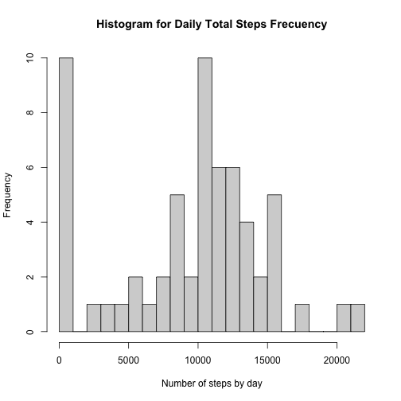
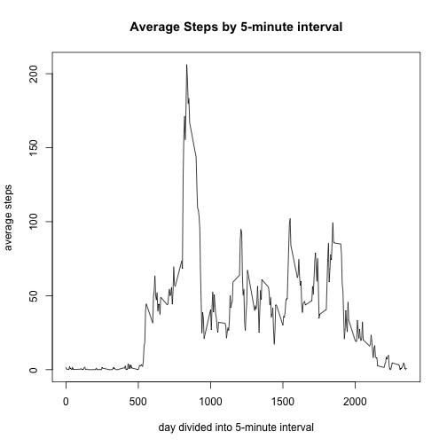
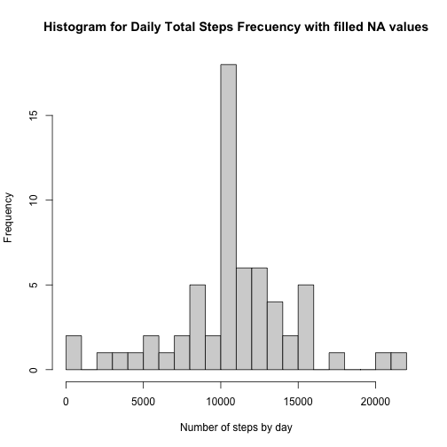
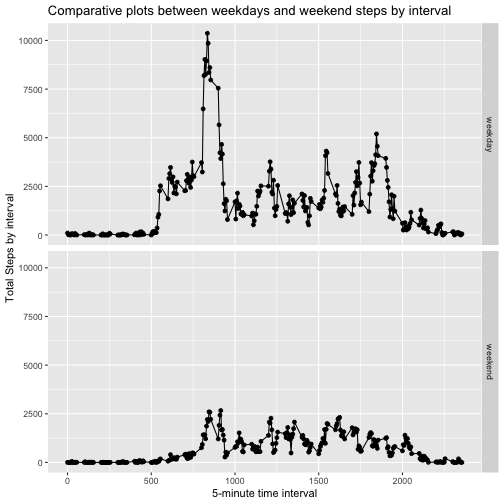

Personal Movement activiy analysis
==================================

## Introduction
it is now possible to collect a large amount of data about personal movement using activity monitoring devices such as a [Fitbit](http://www.fitbit.com/), [Nike Fuelband](http://www.nike.com/us/en_us/c/nikeplus-fuelband), or [Jawbone Up](https://jawbone.com/up). These type of devices are part of the “quantified self” movement – a group of enthusiasts who take measurements about themselves regularly to improve their health, to find patterns in their behavior, or because they are tech geeks. But these data remain under-utilized both because the raw data are hard to obtain and there is a lack of statistical methods and software for processing and interpreting the data.

This assignment makes use of data from a personal activity monitoring device. This device collects data at 5 minute intervals through out the day. The data consists of two months of data from an anonymous individual collected during the months of October and November, 2012 and include the number of steps taken in 5 minute intervals each day.

The data for this assignment can be downloaded from the course web site:

-Dataset: [Activity monitoring data](https://d396qusza40orc.cloudfront.net/repdata%2Fdata%2Factivity.zip) [52K]

The variables included in this dataset are:

-**steps**: Number of steps taking in a 5-minute interval (missing values are coded as \color{red}{\verb|NA|}NA)

-**date**: The date on which the measurement was taken in YYYY-MM-DD format

-**interval**: Identifier for the 5-minute interval in which measurement was taken

The dataset is stored in a comma-separated-value (CSV) file and there are a total of 17,568 observations in this dataset.

## Loading and preprocessing the data

Show any code that is needed to

1. Load the data (i.e. \color{red}{\verb|read.csv()|}read.csv())

2. Process/transform the data (if necessary) into a format suitable for your analysis


The first thing to do is to load all the necessary libraries


```r
library(lubridate)
library(dplyr)
library(ggplot2)
```


The next thing to do is download the file and load it into memory


```r
fileurl <- "https://d396qusza40orc.cloudfront.net/repdata%2Fdata%2Factivity.zip"
download.file(fileurl, "./AMD.zip", method = "curl")
unzip("./AMD.zip")
Activity <- read.csv("./activity.csv")
```


As we are going to work with the dates, it is convenient to convert the variable "date" to type date


```r
Activity$date <- as.Date(Activity$date)
```

## What is mean total number of steps taken per day?

Note: For this part of the assignment, you can ignore the missing values in the dataset.

1. Calculate the total number of steps taken per day

To calculate the total number of steps per day, the first thing to do is use the summarize function, to have the total number of steps per day


```r
daygroup <- group_by(Activity, date)
totalstepsbyday <- summarize(daygroup, totalsteps = sum(steps, na.rm = TRUE))
```

```
## `summarise()` ungrouping output (override with `.groups` argument)
```


the result of the summarize function was assigned a new variable *totalstepsbyday* which we will use next to answer the rest of the questions

2. Make a histogram of the total number of steps taken each day

Several tests were carried out in order to obtain a frequency representation that was simple enough, but complete. Thus, the following statement was used:


```r
hist(totalstepsbyday$totalsteps, breaks = 20, main = "Histogram for Daily Total Steps Frecuency", xlab = "Number of steps by day")
```



This representation was used to show bars of 1000, and to be able to better visualize how the frequency of the steps per day is distributed. In this way, it can be seen that given the omission of NA values ​​at the time of adding in the summarize function, there are many days with low values, which can be seen in the first bar of the histogram. Then, it can be seen that there is a concentration around the average number of steps per day

 
3. Calculate and report the mean and median of the total number of steps taken per day


```r
mean(totalstepsbyday$totalsteps, na.rm = TRUE)
```

```
## [1] 9354.23
```

```r
median(totalstepsbyday$totalsteps, na.rm = TRUE)
```

```
## [1] 10395
```

## What is the average daily activity pattern?

1. Make a time series plot (i.e. \color{red}{\verb|type = "l"|}type = "l") of the 5-minute interval (x-axis) and the average number of steps taken, averaged across all days (y-axis)


To answer this question, it is necessary to perform a new grouping, this time by means of the interval variable. With this, by using the summarize function again we can get to obtain the average values ​​of steps for each time interval


```r
intervalgroup <- group_by(Activity, interval)
averagebyinterval <- summarize(intervalgroup, averagesteps = mean(steps, na.rm = TRUE))
```

```
## `summarise()` ungrouping output (override with `.groups` argument)
```

Next, the graph of the average value of the steps for each time interval is presented, as expected, for the hours of sleep, it is almost zero and reflects that the activity begins around 5 in the morning


```r
with(averagebyinterval, plot(interval, averagesteps, type = "l", xlab = "day divided into 5-minute interval", ylab = "average steps", main = "Average Steps by 5-minute interval"))
```



2. Which 5-minute interval, on average across all the days in the dataset, contains the maximum number of steps?


```r
averagebyinterval[which.max(averagebyinterval$averagesteps), 1]
```

```
## # A tibble: 1 x 1
##   interval
##      <int>
## 1      835
```

The maximum average value of steps in an interval, occurs in the interval from 8:35 to 8:40 in the morning

## Imputing missing values

Note that there are a number of days/intervals where there are missing values (coded as \color{red}{\verb|NA|}NA). The presence of missing days may introduce bias into some calculations or summaries of the data.

1. Calculate and report the total number of missing values in the dataset (i.e. the total number of rows with \color{red}{\verb|NA|}NAs)


```r
sum(is.na(Activity$steps))
```

```
## [1] 2304
```

2. Devise a strategy for filling in all of the missing values in the dataset. The strategy does not need to be sophisticated. For example, you could use the mean/median for that day, or the mean for that 5-minute interval, etc.

Since the average of steps per interval had been calculated previously, that value will be used to impute the missing values

3. Create a new dataset that is equal to the original dataset but with the missing data filled in.


```r
repActivity <- Activity
for (i in 1:nrow(repActivity)){
  if (is.na(repActivity[i,1])) {
    repActivity[i, 1] <- averagebyinterval[averagebyinterval$interval == repActivity[i, 3], 2]
  }
}
```


4. Make a histogram of the total number of steps taken each day and Calculate and report the mean and median total number of steps taken per day. Do these values differ from the estimates from the first part of the assignment? What is the impact of imputing missing data on the estimates of the total daily number of steps?

For the presentation of the requested histogram, the same steps are carried out as in the case previously seen


```r
repdaygroup <- group_by(repActivity, date)
reptotalstepsbyday <- summarize(repdaygroup, totalsteps = sum(steps, na.rm = TRUE))
```

```
## `summarise()` ungrouping output (override with `.groups` argument)
```


```r
hist(reptotalstepsbyday$totalsteps, breaks = 20, main = "Histogram for Daily Total Steps Frecuency with filled NA values", xlab = "Number of steps by day")
```




```r
mean(reptotalstepsbyday$totalsteps)
```

```
## [1] 10766.19
```

```r
median(reptotalstepsbyday$totalsteps)
```

```
## [1] 10766.19
```

Given the data imputation strategy chosen, it can be seen that the days close to the average value are reinforced and the rest of the values ​​decrease and the median coincides with the new average value.

## Are there differences in activity patterns between weekdays and weekends?

For this part the \color{red}{\verb|weekdays()|}weekdays() function may be of some help here. Use the dataset with the filled-in missing values for this part.

1. Create a new factor variable in the dataset with two levels – “weekday” and “weekend” indicating whether a given date is a weekday or weekend day.


```r
repActivity$weekday <- weekdays(repActivity$date)
for (i in 1:nrow(repActivity)){
  if (repActivity[i,4] == "Saturday" | repActivity[i, 4] == "Sunday"){
    repActivity[i, 4] = "weekend"
  }
  else {
    repActivity[i, 4] = "weekday"
  }
}
repActivity$weekday <- as.factor(repActivity$weekday)
```


2. Make a panel plot containing a time series plot (i.e. \color{red}{\verb|type = "l"|}type = "l") of the 5-minute interval (x-axis) and the average number of steps taken, averaged across all weekday days or weekend days (y-axis). See the README file in the GitHub repository to see an example of what this plot should look like using simulated data.

The summarize function is used again to prepare the data before plotting


```r
weekdaygroup <- group_by(repActivity, interval, weekday)
reptotalstepsbyweek <-summarize(weekdaygroup, totalsteps = sum(steps, na.rm = TRUE))
```

```
## `summarise()` regrouping output by 'interval' (override with `.groups` argument)
```


```r
qplot(interval, totalsteps, data = reptotalstepsbyweek, facets = weekday ~ .) + geom_line() + labs(x= "5-minute time interval") + labs(y= "Total Steps by interval") + labs(title = "Comparative plots between weekdays and weekend steps by interval")
```



